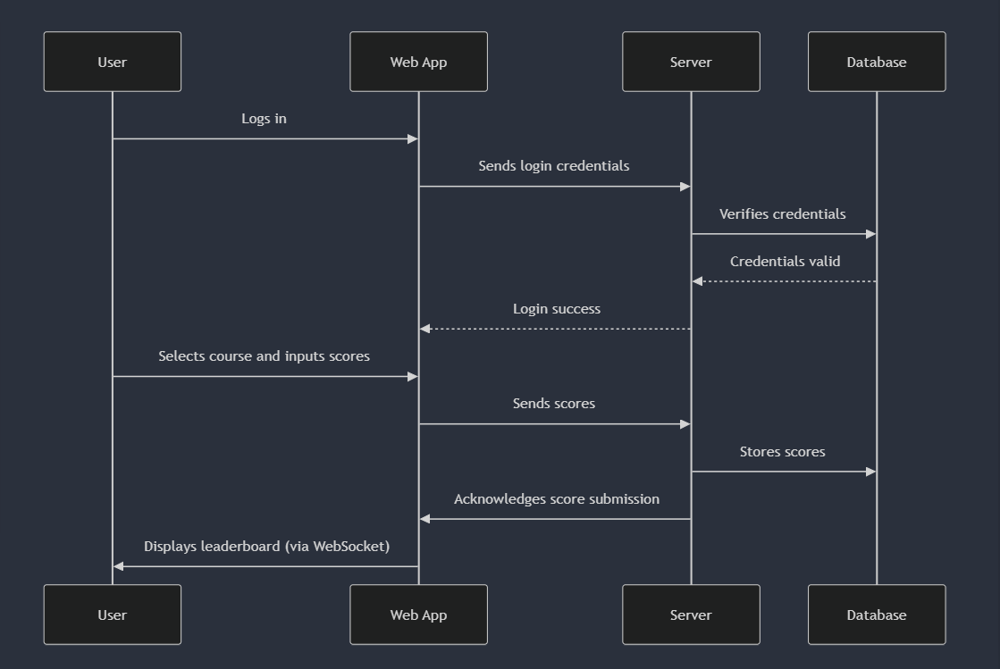

# BYU DG Stats

## Elevator pitch

Disc Golf is a small sport, and an even smaller collegiate sport. As such the BYU disc golf team has no where to keep track of stats. When they play courses for practice not all the data gets saved, and it is difficult for them to make sure their best players are being put in tournaments. The BYU DG Stats application will allow the team members to pick their course, enter their scores per hole, and get live leaderboard updates as they practice. This will also allow them to see their averages for each hole and for each course. Greatly aiding in their ability to see their progress.

## Design
Users will input scores

Users can see leaderboard

Sequence Diagram on how users interact
