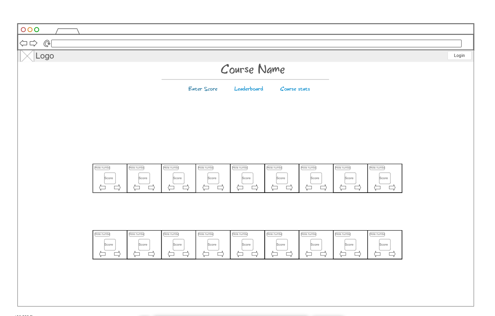
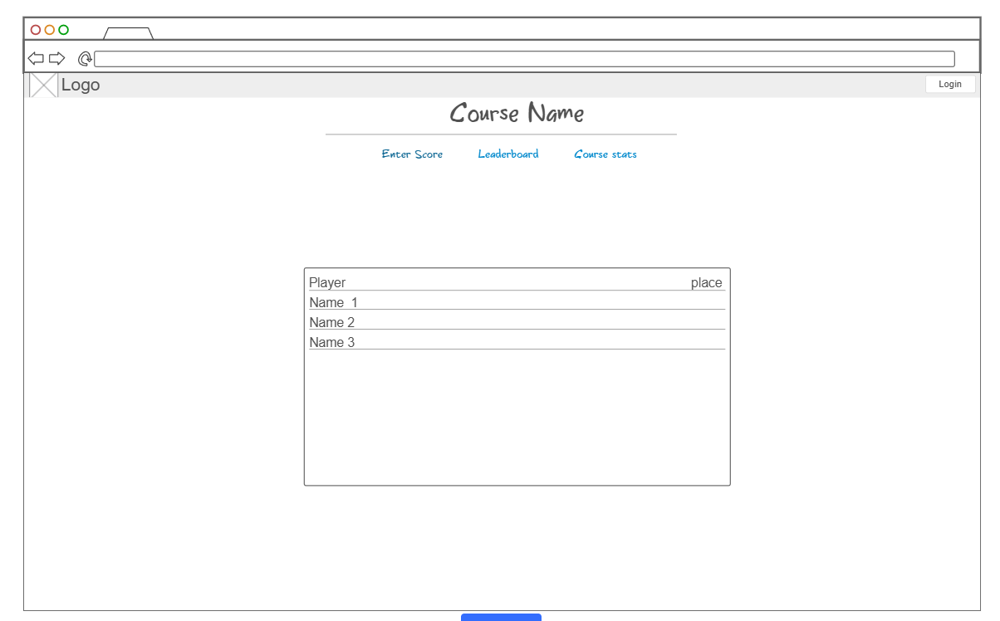
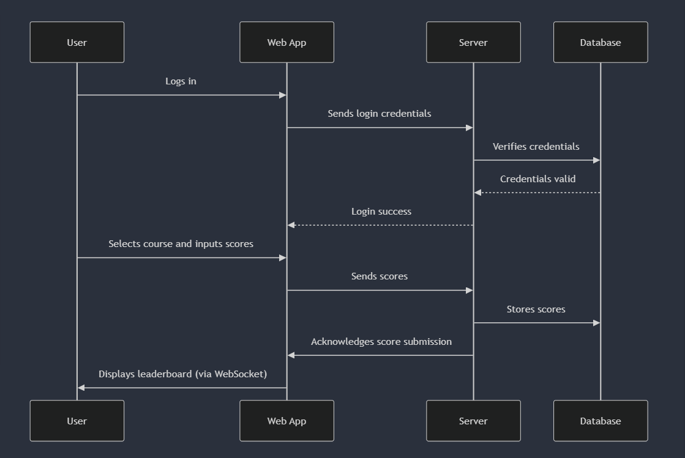

# BYU DG Stats

## Elevator pitch

Disc Golf is a small sport, and an even smaller collegiate sport. As such the BYU disc golf team has no where to keep track of stats. When they play courses for practice not all the data gets saved, and it is difficult for them to make sure their best players are being put in tournaments. The BYU DG Stats application will allow the team members to pick their course, enter their scores per hole, and get live leaderboard updates as they practice. This will also allow them to see their averages for each hole and for each course. Greatly aiding in their ability to see their progress.

## Design
Users will input scores

Users can see leaderboard

Sequence Diagram on how users interact with webpage

## Key Features

- **Secure Login**: Users can securely log in.
- **Course Selection**: Users can choose from a list of available courses to track their practice sessions.
- **Score Input**: Players can enter their scores for each hole in real-time.
- **Live Leaderboard**: The leaderboard updates in real-time to reflect current scores and rankings.
- **Average Calculation**: Users can view their average scores for each hole and each course.
- **Persistent Data Storage**: All scores and user data are stored persistently in the database.
- **Real-Time Updates**: Web sockets provide real-time updates for score changes and leaderboard adjustments.
- **User Profile Management**: Players can manage their profiles and view their performance history.
- **Admin Functions**: Administrators can add or remove courses, and manage user accounts.

## Technologies

How I am going to use the required technologies:

- **HTML**: Utilizes structured HTML to create the application's pages, including course selection, score input, and leaderboard displays.
- **CSS**: Styles the application for a visually appealing interface that is responsive across different devices, ensuring good design use.
- **JavaScript**: Handles user-side interactions, such as score input validation, real-time updates, and content changes.
- **React**: Manages user interface components, routing, and state management. Provides a dynamic experience for score tracking, leaderboard display, and user profile management.
- **Express.js**: Implements the backend service with RESTful API endpoints for:
  - User login
  - Retrieving and updating scores
  - Managing course data
  - Fetching leaderboard information
- **Node.js**: Powers the server-side logic and integrates with the Express.js framework for handling API requests.
- **MongoDB**: Stores user data, course information, and scores persistently. Supports efficient querying and data retrieval for real-time updates.
- **WebSocket**: Enables real-time communication for live score updates and leaderboard changes, ensuring that all users receive immediate updates.
- **HTTPS**: Secures data transmission between the client and server, protecting user credentials and sensitive information.
**External Web Service**:
  - **Weather API**: Uses the [WeatherAPI](http://weatherapi.com) to fetch weather data for courses, allowing users to view current weather conditions for their practice sessions.
    - **Endpoint**: `http://api.weatherapi.com/v1/current.json`
    - **Function**: `fetchWeather` - Retrieves current weather data based on the course location.
## HTML deliverable

For this deliverable I created the structure of my site using HTML

- [x] **HTML pages** - Four HTML pages representing a main page, keeping score, stats, and a leaderboard
- [x] **Links** - Each page contains navigation links to allow easy access between the home page, leaderboard, stats, and scorecard.
- [x] **Text** - Each page includes relevant headings and descriptive text for user guidance.
- [x] **Images** - Team logo is included on each page. Course map images to follow.
- [x] **Login Form/Database** - The main page contains a login input placeholder. The score card page shows a potential way to input scores.
- [x] **Real-Time Communication** - The leaderboard includes placeholders for displaying real-time player scores and information.
- [x] **Weather API Integration** -placeholder made. integrated the weather API now as the idea of doing it later stressed me. It currently works in vs code live but not the actual site.

## CSS Deliverable

For this deliverable, I styled the application into its final appearance.

 - [x] **Header, Footer, and Main Content Body** - The header and footer are styled to match the overall theme of the site using BYU colors and the team logo. The "Keep Score" page has a different background as the logo was intrusive.
 - [x] **Navigation Elements** - Navigation links are now resizable and adjust to screen size changes. The "Keep Score" page also features a smaller header on smaller screens to optimize space.
 - [x] **Responsive Design** - The application is responsive on standard screen sizes, providing a smooth experience across most devices. Some layout issues may occur at extreme window sizes.
 - [x] **Application Elements** - Clutter was minimized by ensuring good use of whitespace, keeping the focus on the content.
 - [x] **Consistent Fonts** - All text content follows a consistent font scheme to ensure uniformity.
 - [x] **Application Images** - Currently, the team logo is the only image used. Future plans may include adding a slideshow of team photos to the homepage.